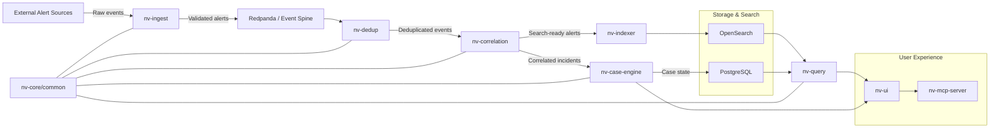

# NeuralVyuha Working Flow

This document describes the end-to-end working flow of the NeuralVyuha platform. It covers how alerts move through the system, how the core microservices collaborate, and where each component fits in the security incident response pipeline.

## System Flow Overview

The working flow is built on a streaming and event-driven architecture. The primary path is:

1. External alert sources send raw security events into `nv-ingest`.
2. `nv-ingest` validates, authenticates, and routes alerts into the event spine.
3. `nv-dedup` removes repeated noise and groups the same activity into correlation candidates.
4. `nv-correlation` applies higher-level rules and constructs incident groups.
5. `nv-case-engine` stores case state, investigation data, tasks, and observables.
6. `nv-indexer` writes the searchable event data into OpenSearch.
7. `nv-query` serves the UI and external consumers with fast read APIs.
8. `nv-ui` and `nv-mcp-server` provide the user-facing investigation experience.

## Graphical Working Flow

## Detailed Step-by-Step Flow

### 1. Alert Ingestion
- `nv-ingest` is the first service in the pipeline.
- It receives alerts from sources such as Wazuh, Suricata, and other security tools.
- The service validates payloads, enforces rate limits, and authenticates senders.
- Valid alerts are published into the event spine (`Redpanda / Kafka`).

### 2. Event Spine and Routing
- The event spine is responsible for reliably transporting alert messages.
- It decouples inbound ingestion from downstream processors.
- It also allows the platform to scale horizontally by adding more consumer instances.

### 3. Deduplication
- `nv-dedup` consumes the raw event stream.
- It uses Redis to track repeated alert signatures and reduce duplicate noise.
- Deduplication produces a clean stream of unique events and candidate groups.

### 4. Correlation
- `nv-correlation` evaluates events against business rules.
- It joins related alerts into meaningful incidents and correlation groups.
- Rules may detect patterns such as brute-force sequences, suspicious access, or lateral movement.

### 5. Case Engine and Persistence
- `nv-case-engine` stores the authoritative case model.
- It manages investigations, tasks, observables, and TTP metadata.
- Incident state is persisted in PostgreSQL.

### 6. Indexing and Search
- `nv-indexer` writes the normalized event stream into OpenSearch.
- Search documents are optimized for fast query and dashboard retrieval.
- This enables quick threat hunting, alert search, and reporting.

### 7. Query and UI Read Path
- `nv-query` acts as the unified read API layer.
- It reads from both PostgreSQL and OpenSearch to assemble UI responses.
- This service returns data for dashboards, alert viewers, and investigation workflows.

### 8. User Interface and AI Assistance
- `nv-ui` is the web-based frontend for security analysts.
- It communicates with `nv-query` and `nv-case-engine` to present alerts and cases.
- `nv-mcp-server` provides AI-assisted investigation workflows and chat-driven support.

## Component Roles

- `nv-ingest`: gateway for incoming alerts, validation, and routing.
- `nv-dedup`: noise reduction and duplicate detection.
- `nv-correlation`: high-level incident grouping and rule logic.
- `nv-case-engine`: case lifecycle, tasks, and investigation state.
- `nv-indexer`: search indexing into OpenSearch.
- `nv-query`: API layer for reads and UI consumption.
- `nv-ui`: analyst-facing frontend.
- `nv-mcp-server`: AI threat copilot and investigation assistant.
- `nv-core/common`: shared authentication, config, and observability utilities.

## How to Use This Document

- Use this file as the primary architecture reference for how alerts flow through NeuralVyuha.
- Follow the diagram when debugging data pipeline issues or when extending any service.
- Keep this document updated as new microservices are added or rules change.
